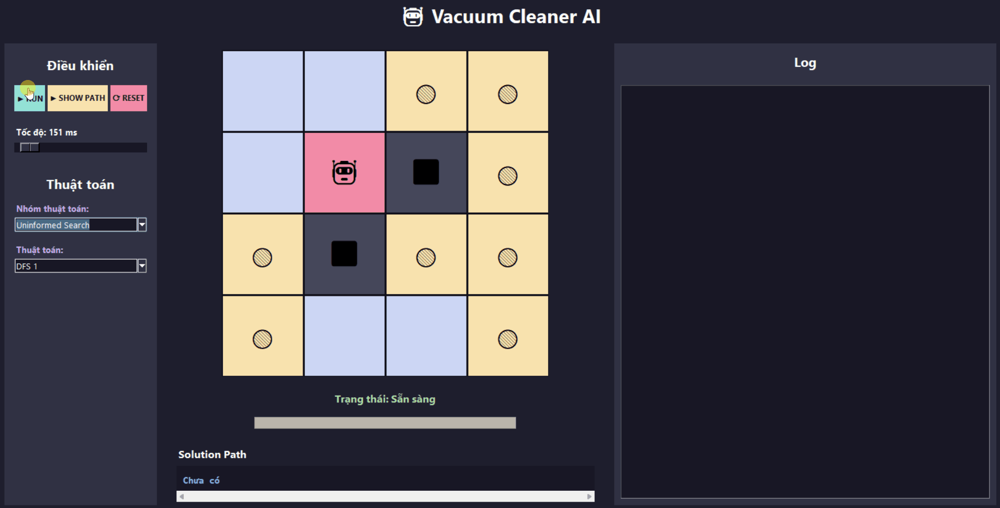
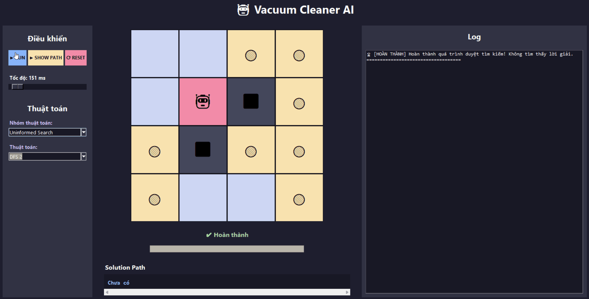
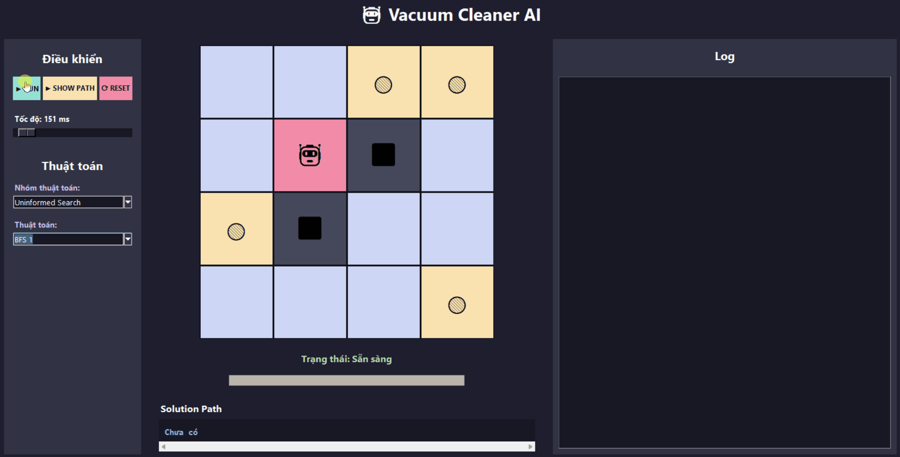
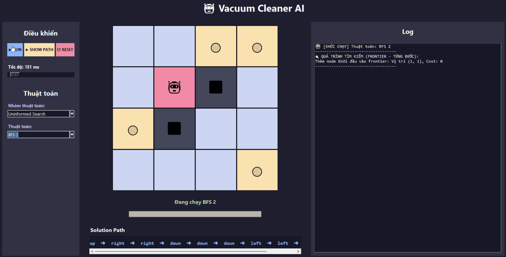
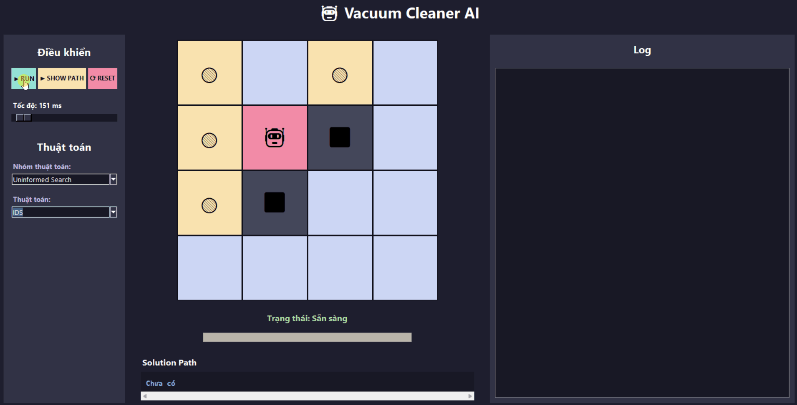
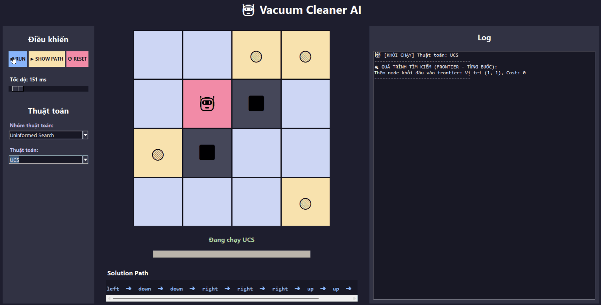
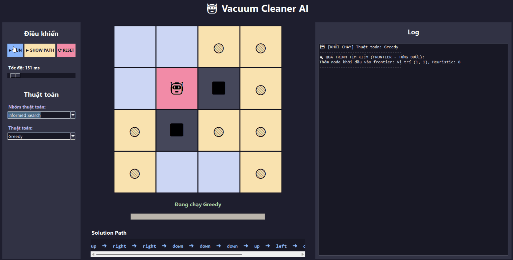
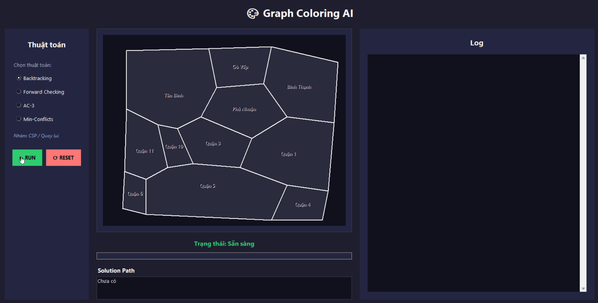
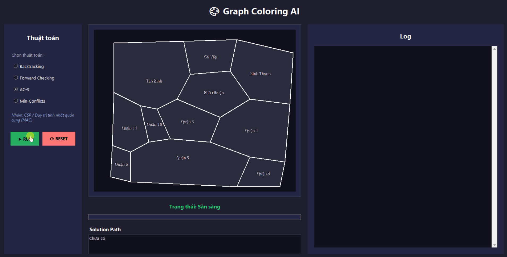

<h1 align="center">Artificial Intelligence Search Algorithms Visualization</h1>
<p align="center">
<b>Huỳnh Ngọc Bảo Khang</b><br>
Student ID: <b>24110241</b>
</p>

---

# 📑 Table of Contents

- [🚀 Getting Started (Hướng dẫn cài đặt & sử dụng)](#-getting-started-hướng-dẫn-cài-đặt--sử-dụng)
- [📁 Project Structure (Cấu trúc dự án)](#-project-structure-cấu-trúc-dự-án)
- [🎬 Algorithm Demonstrations](#-algorithm-demonstrations)
  - [🔹 Uninformed Search (Vacuum World)](#-uninformed-search)
  - [🤖 Informed Search (Vacuum World)](#-informed-search)
  - [⛰️ Local Search (Vacuum World)](#️-local-search)
  - [🧩 Complex Vacuum World](#-complex-vacuum-world)
  - [🎨 Graph Coloring (CSP)](#-graph-coloring-constraint-satisfaction-problems)
  - [❌ Adversarial Search (Tic-Tac-Toe)](#-adversarial-search-tic-tac-toe)
- [📚 Algorithms Implemented](#-algorithms-implemented)

---

# 🚀 Getting Started (Hướng dẫn cài đặt & sử dụng)

### 💻 Yêu cầu hệ thống
- **Python 3.8+**
- Không yêu cầu cài đặt thư viện ngoài (sử dụng hoàn toàn thư viện chuẩn `tkinter` của Python).

### 🛠️ Cài đặt và Chạy ứng dụng

1. **Clone repository về máy**:
   ```bash
   git clone https://github.com/your-username/your-repo.git
   cd your-repo
   ```

2. **Khởi chạy Menu Chính (Khuyên dùng)**:
   Tại thư mục gốc của dự án, chạy lệnh:
   ```bash
   python main.py
   ```
   Ứng dụng sẽ mở lên một Menu Chính (AI Projects Hub) cho phép bạn chọn và truy cập vào 3 mô-đun mô phỏng: Máy hút bụi (Vacuum), Tô màu đồ thị (Graph Coloring), và Cờ Caro (Tic-Tac-Toe). Giao diện menu được thiết kế hiện đại và có khả năng tự động liên kết với các app con một cách mượt mà.

3. **Khởi chạy từng mô-đun độc lập (Tùy chọn)**:
   Nếu bạn chỉ muốn mở một bài toán cụ thể, có thể chạy trực tiếp file `app.py` bên trong từng thư mục:
   - Vacuum World: `cd AppVaccum && python app.py`
   - Graph Coloring: `cd GraphColoring && python app.py`
   - Tic-Tac-Toe: `cd TicTacToe && python app.py`

### 🎮 Cách sử dụng UI
- **Chọn thuật toán**: Sử dụng Menu Dropdown (Combobox) hoặc Radio Button ở cột bên trái màn hình.
- **Tốc độ (Speed)**: Kéo thanh trượt để điều chỉnh tốc độ hiệu ứng hoạt ảnh mô phỏng.
- **Run/Stop/Reset**: Nhấn **RUN** để bắt đầu mô phỏng từng bước của thuật toán. Nhấn **RESET** để làm mới lại trạng thái bàn cờ/đồ thị.
- **Logs & Thông số AI**: Quan sát bảng thông báo (Log) ở cột bên phải hoặc bên dưới để xem chi tiết quá trình AI suy nghĩ, số lượng trạng thái duyệt, số lần cắt tỉa (Pruning Cuts) và đưa ra quyết định.

---

# 📁 Project Structure (Cấu trúc dự án)

Mã nguồn dự án được tổ chức gọn gàng thành các gói (packages) chuyên biệt theo nhóm thuật toán AI:

```text
├── main.py                     # Menu chính trung tâm kết nối các mô-đun
├── AppVaccum/                  # 🧹 Máy Hút Bụi (Đường đi & Tìm kiếm)
│   ├── app.py                  
│   ├── uninform/               # Tìm kiếm mù (BFS, DFS, UCS, IDS)
│   ├── inform/                 # Tìm kiếm có thông tin (A*, Greedy, IDA*)
│   ├── local/                  # Tìm kiếm cục bộ (Hill Climbing, Simulated Annealing...)
│   └── complex_environment/    # Môi trường phức tạp (And-Or, Partially Observable...)
├── GraphColoring/              # 🎨 Tô Màu Đồ Thị (Thỏa mãn ràng buộc)
│   ├── app.py                  
│   └── csp/                    # Các thuật toán CSP (AC-3, Backtracking, Min Conflicts...)
└── TicTacToe/                  # ❌ Cờ Caro (Đối kháng)
    ├── app.py                  
    └── adversal/               # Các thuật toán Game (Minimax, Alpha-Beta, Expectimax)
```

---

# 🎬 Algorithm Demonstrations

## 🌟 Main Menu (Giao diện chọn chế độ)
Giao diện trung tâm giúp bạn điều hướng và khởi chạy các mô phỏng AI một cách dễ dàng và trực quan. 

<p align="center">

</p>

---

# 🧹 AppVacuum
# 🔹 Uninformed Search
Các thuật toán tìm kiếm cơ bản không sử dụng thông tin về khoảng cách hay chi phí tới mục tiêu. Thuật toán chỉ duyệt qua các trạng thái dựa trên cấu trúc đồ thị của môi trường Vacuum World để tìm đường đi.
## 🌲 Depth First Search (DFS)

| DFS Example 1 | DFS Example 2 |
|:-------------:|:-------------:|
|  |  |

---

## 🌊 Breadth First Search (BFS)

| BFS Example 1 | BFS Example 2 |
|:-------------:|:-------------:|
|  |  |

---

## 🔍 Iterative Deepening Search (IDS)

<p align="center">

</p>

---

## 💰 Uniform Cost Search (UCS)

<p align="center">

</p>

---

# 🤖 Informed Search
Nhóm thuật toán tối ưu hơn nhờ sử dụng hàm Heuristic ước lượng khoảng cách từ trạng thái hiện tại đến cái đích cần dọn dẹp. Giúp Robot hút bụi định hướng thông minh hơn, giảm thiểu số bước duyệt thừa.
## ⭐ A* Search

<p align="center">

</p>

---

## 🧭 Greedy Best First Search

<p align="center">

</p>

---

## 🚀 Iterative Deepening A* (IDA*)

<p align="center">

</p>

---

# ⛰️ Local Search
Nhóm thuật toán tập trung vào việc cải tiến trạng thái hiện tại bằng cách di chuyển sang các trạng thái lân cận tốt hơn. Phù hợp cho việc tối ưu hóa lộ trình trực tiếp mà không cần lưu trữ toàn bộ cây tìm kiếm.
## 📈 Simple Hill Climbing

<p align="center">

</p>

---

## 🏔️ Steepest Ascent Hill Climbing

<p align="center">

</p>

---

## 🎲 Stochastic Hill Climbing

<p align="center">

</p>

---

## 🔄 Random Restart Hill Climbing

<p align="center">

</p>

---

## 🌡️ Simulated Annealing

<p align="center">

</p>

---

## 🔦 Local Beam Search

<p align="center">

</p>

---

# 🧩 Complex Vacuum World

Mô phỏng các kịch bản nâng cao và thực tế hơn của Robot hút bụi khi đối mặt với môi trường không chắc chắn, không thể quan sát toàn diện hoặc có các yếu tố ngẫu nhiên xảy ra.
## 🌳 AND-OR Search

<p align="center">

</p>

---

## 🧠 Belief State Search

<p align="center">

</p>

---

## 👀 Partially Observable Environment

<p align="center">

</p>

---

# 🎨 Graph Coloring (Constraint Satisfaction Problems)

Giải quyết bài toán **Tô màu bản đồ các quận tại TP. Hồ Chí Minh** bằng phương pháp Thỏa mãn ràng buộc (CSP). Mục tiêu là tô màu sao cho không có hai quận nào liền kề nhau có cùng một màu sắc, sử dụng số lượng màu tối thiểu.
## ↩️ Backtracking Search

<p align="center">

</p>

---

## 🔍 Forward Checking

<p align="center">

</p>

---

## 📐 AC-3 (Arc Consistency)

<p align="center">

</p>

---

## 💥 Min-Conflicts Local Search

<p align="center">

</p>

---

# ❌ Adversarial Search (Tic-Tac-Toe)
Mô phỏng các thuật toán tìm kiếm đối kháng thông qua trò chơi **Cờ ca-rô (Tic-Tac-Toe)**. Trực quan hóa luồng tư duy, số lượng trạng thái phải duyệt và khả năng cắt tỉa của AI khi đối đầu với người chơi hoặc một AI khác.
## 🪵 Minimax Algorithm

<p align="center">

</p>

---

## ✂️ Alpha-Beta Pruning

<p align="center">

</p>

---

## 🎲 Expectimax Search

<p align="center">

</p>

---

# 📚 Algorithms Implemented

| Category | Algorithms |
|-----------|------------|
| 🔹 **Uninformed Search** | DFS • BFS • IDS • UCS |
| 🤖 **Informed Search** | Greedy Best First Search • A* • IDA* |
| ⛰️ **Local Search** | Simple Hill Climbing • Steepest Ascent Hill Climbing • Stochastic Hill Climbing • Random Restart Hill Climbing • Simulated Annealing • Local Beam Search |
| 🧩 **Complex Vacuum World** | AND-OR Search • Belief State Search • Partially Observable Search |
| 🎨 **Graph Coloring (CSP)** | Backtracking • Forward Checking • AC-3 • Min-Conflicts |
| ❌ **Tic-Tac-Toe (Adversarial)** | Minimax • Alpha-Beta Pruning • Expectimax |

---
